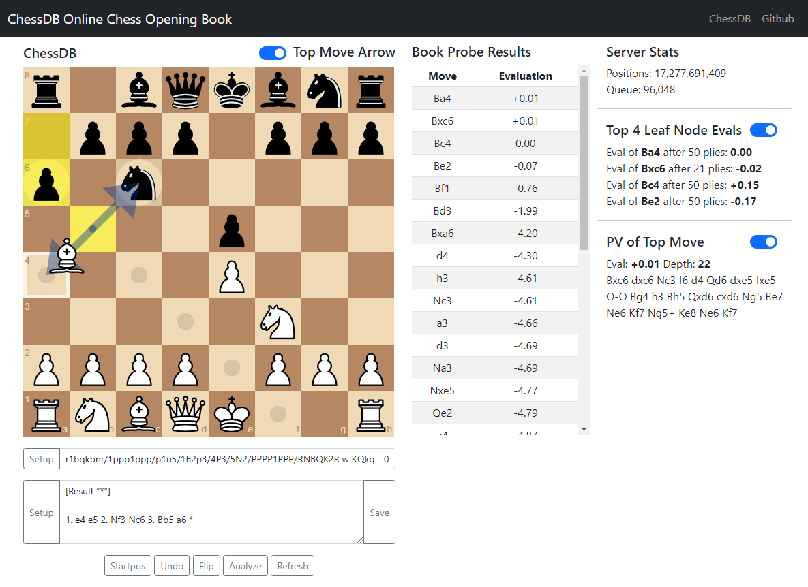

# ChessDB Online Book
A web page where user can see chess opening moves from the online [ChessDB](https://chessdb.cn/queryc_en/).

### Web address
https://dav1312.github.io/ChessDB-Online-Book/

### Credits
 - ChessDB: https://github.com/noobpwnftw/chessdb

 - Chessboardjs: https://chessboardjs.com/

 - Chessjs: https://github.com/jhlywa/chess.js
